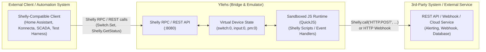

# Yllehs

Yllehs (pronounced “Illes”) is a software emulator for physical Shelly IoT devices designed to expose **stateful virtual device states** and execute **Shelly JavaScript logic** via official, unmodified Shelly APIs (RPC and REST).

---

## Purpose

Many third-party home automation systems, IoT controllers, and integration clients can only execute custom logic or fetch external state by talking directly to real Shelly hardware interfaces. 

Yllehs bridges this gap by acting as a lightweight, software-defined Shelly fleet:
- Exposes **stateful variables** (switch outputs, input triggers, power metering, device statuses) backed by realistic Shelly hardware models.
- Executes **native Shelly JavaScript scripts** inside a sandboxed QuickJS runtime to handle logic, timers, and event-driven automation.
- Allows external clients and test harnesses limited to Shelly API interfaces to interact with other 3rd party systems using Yllehs devices as bridges/adapters.

### Architecture



---

## Features

- **Multi-Device Hosting**: Run multiple virtual Shelly devices with isolated state, ports, and JavaScript runtimes in a single process / container.
- **Generation-Aware APIs**:
  - **Gen 1** (`shelly1`, `shelly1pm`, `shelly25`): Traditional REST API endpoints (`/relay/0?turn=on`, `/settings`, `/status`, `/shelly`).
  - **Gen 2 / Gen 3** (`plus-1`, `plus-1pm`, `plus-2pm`, `plus-4pm`, `plus-i4`, `1-gen3`, `1pm-gen3`): Full Shelly RPC protocol (`/rpc`, `/rpc/<method>`, `/status`, `/shelly`).
- **Real Shelly JavaScript Runtime (QuickJS)**:
  - Native sandboxing (no host OS leakage or arbitrary `eval()`).
  - Implements `Shelly.call()`, `Shelly.addEventHandler()`, `Shelly.addStatusHandler()`, `Shelly.getComponentStatus()`, `Shelly.getComponentConfig()`, `Shelly.getDeviceInfo()`.
  - Implements `Timer.set()`, `Timer.clear()`, `print()`, `console.log()`.
- **Simulation Control**: Test trigger endpoints (`POST /_yllehs/simulate/input/{id}`) completely isolated from emulated Shelly device APIs.

---

## Supported Models

| Model | Gen | Components | API Type |
|---|---|---|---|
| `shelly1` | Gen 1 | `relay:0`, `input:0` | REST |
| `shelly1pm` | Gen 1 | `relay:0`, `input:0`, `pm:0` | REST |
| `shelly25` | Gen 1 | `relay:0`, `relay:1`, `input:0`, `input:1`, `pm:0`, `pm:1` | REST |
| `plus-1` | Gen 2 | `switch:0`, `input:0` | RPC + JS |
| `plus-1pm` | Gen 2 | `switch:0`, `input:0` | RPC + JS |
| `plus-2pm` | Gen 2 | `switch:0`, `switch:1`, `input:0`, `input:1` | RPC + JS |
| `plus-4pm` | Gen 2 | `switch:0..3`, `input:0..3` | RPC + JS |
| `plus-i4` | Gen 2 | `input:0..3` | RPC + JS |
| `1-gen3` | Gen 3 | `switch:0`, `input:0` | RPC + JS |
| `1pm-gen3` | Gen 3 | `switch:0`, `input:0` | RPC + JS |

---

## Docker Compose Example

The repository includes a complete out-of-the-box multi-device setup with custom JavaScript event and status listeners.

### 1. Structure

- `docker-compose.yml`: Spawns the Yllehs emulator container and maps ports `8080`–`8083`. Mounts `./scripts` into `/app/scripts` and `./yllehs.yaml` into `/app/yllehs.yaml`.
- `yllehs.yaml`: Declares 4 virtual devices (`garage` on `:8080`, `lights` on `:8081`, `shutters` on `:8082`, `old-relay` on `:8083`).
- `scripts/alarm.js`: JavaScript script mounted into the `garage` virtual Shelly device that monitors `switch:0` state changes and `input:0` button events.

### 2. Run Container

```bash
docker compose up --build
```

Container startup logs:
```text
yllehs-1  | Started virtual Shelly device 'garage' (model: plus-1) on http://0.0.0.0:8080
yllehs-1  | [garage] Alarm controller script initialized on virtual Shelly!
yllehs-1  | Started virtual Shelly device 'lights' (model: plus-1pm) on http://0.0.0.0:8081
yllehs-1  | Started virtual Shelly device 'shutters' (model: plus-2pm) on http://0.0.0.0:8082
yllehs-1  | Started virtual Shelly device 'old-relay' (model: shelly1) on http://0.0.0.0:8083
```

### 3. Trigger Script Actions via `curl`

#### Action A: Toggle Switch on `garage` (`:8080`)
Set `switch:0` to `true`:
```bash
curl -s -X POST http://localhost:8080/rpc \
  -H "Content-Type: application/json" \
  -d '{"id": 1, "src": "test-client", "method": "Switch.Set", "params": {"id": 0, "on": true}}'
```
or via HTTP GET shortcut:
```bash
curl -s "http://localhost:8080/rpc/Switch.Toggle?id=0"
```

**Observed in `docker compose` logs:**
```text
[garage] [SCRIPT NOTIFICATION] Switch 0 changed state -> output: true (source: RPC)
```

#### Action B: Trigger Hardware Button Event on `garage` (`:8080`)
Simulate external physical button click (`btn_down`) via test control endpoint:
```bash
curl -s -X POST http://localhost:8080/_yllehs/simulate/input/0 \
  -H "Content-Type: application/json" \
  -d '{"event": "btn_down", "state": true}'
```

**Observed in `docker compose` logs:**
```text
[garage] [SCRIPT NOTIFICATION] Input 0 triggered event: btn_down
```

---

## API Reference & Examples

### Gen 2 / Gen 3 (Shelly Plus & Gen 3 RPC)

**1. Query Device Info:**
```bash
curl -s http://localhost:8080/shelly
```

**2. Query Status via RPC (POST):**
```bash
curl -s -X POST http://localhost:8080/rpc \
  -H "Content-Type: application/json" \
  -d '{"id": 1, "src": "client", "method": "Shelly.GetStatus"}'
```

**3. Turn Switch ON via RPC (POST):**
```bash
curl -s -X POST http://localhost:8080/rpc \
  -H "Content-Type: application/json" \
  -d '{"id": 2, "src": "client", "method": "Switch.Set", "params": {"id": 0, "on": true}}'
```

**4. Toggle Switch via HTTP GET RPC:**
```bash
curl -s "http://localhost:8080/rpc/Switch.Toggle?id=0"
```

**5. Query Switch Status (GET):**
```bash
curl -s "http://localhost:8080/rpc/Switch.GetStatus?id=0"
```

---

### Gen 1 (Shelly 1 / 1PM / 2.5 REST)

**1. Query Status:**
```bash
curl -s http://localhost:8083/status
```

**2. Turn Relay ON:**
```bash
curl -s "http://localhost:8083/relay/0?turn=on"
```

**3. Toggle Relay:**
```bash
curl -s "http://localhost:8083/relay/0?turn=toggle"
```

---

## Quickstart (Local without Docker)

```bash
# Install dependencies
uv sync

# Run server
uv run python -m yllehs.main yllehs.yaml

# Run test suite
uv run pytest
```
